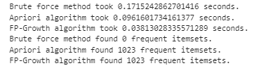

# Comparative Analysis of Data Mining Algorithms
This project involves the implementation and comparison of three different algorithms for frequent itemset mining and association rule generation: brute force, Apriori, and FP-Growth. The project also includes the creation of transactional databases and the generation of association rules based on user-specified parameters.

## Requirements
* Python 3.7 or above
* Libraries: pandas, mlxtend

## Intallation
To install the necessary libraries, run the following command in your terminal:
`pip install pandas mlxtend`

## How to Run the Program
1. Ensure that Python 3.7 or above is installed on your system.
2. Install the necessary libraries using the command provided above.
3. Download the project files, including the Python script and the transactional databases.
4. Open a terminal and navigate to the directory containing the project files.
Run the Python script using the following command:

`Data Mining.ipynb`

## Screenshots
Please refer to the attached screenshots to understand how the program executes and produces output based on different input data and user-specified parameter values.

## Conclusion
The project successfully implemented and compared three different algorithms for frequent itemset mining and association rule generation. The results showed that both Apriori and FP-Growth produced the same number of frequent itemsets, while the brute force method did not find any. In terms of performance, FP-Growth was the fastest, followed by Apriori, and then the brute force method.